##مخطّط الأُطروحة
1. المقدّمة
2. المُعالجات التّعويضيّة الأوّليّة
3. التّعديل الإطباقيّ
4. التّعويضات المرحليّة
5. معالجة التهاب الفم بالأجهزة
6. الجراحة
7. معالجة الأنسجة الدّاعمة
8. المُعالجة التّقويميّة
9. المُعالجات المُحافظة
10. تحضير الأسنان
11. سطوح الإرشاد
12. المُلخّص

##المقدّمة

تصف الفصول المُضمّنة في هذا الجزء الإجراءات المُتّبعة للوصول إلى أفضل بيئة فمويّة تسمح بصناعة تعويض جزئي متحرّك، وقد رُتّبت هذه الفصول وفق تسلسل موافق للممارسة السّريريّة؛ ولكنّ هذا لا ينفي وجود بعض الإجراءات الّتي تُجرى بصورة متزامنة، أو الحاجة إلى تغيير التّسلسل في بعض الحالات.

فيما يلي مثال عن الإجراءات الاعتياديّة للمعالجة:

تُؤخَذ طبعات أوّليّة ثمّ تُصبّ للحصول على أمثلة الدّراسة ويُصنع تعويض مؤقّت في بادئ الأمر، لأنّ تصنيع الجهاز النّهائي قد يتأثر بالمعالجات اللّاحقة أو يُؤثّر بها، ومثال ذلك الحاجة لقلع بعض الأسنان، أو وجود الأجهزة التّقويميّة، أو الإجراءات التّرميميّة؛ وكذلك تُنفّذ كل الإجراءات الّتي تهدف إلى تأمين استقرار حالة المريض الفمويّة بينما يُصنع الجهاز.

تُجرى المعالجات التّالية في وقت مبكّر إن كانت ضروريّة، للأسباب المذكورة:

1. **معالجات تعويضيّة أوّليّة** — للتّغلّب على عيوب الجهاز الجزئيّ الحاليّ في فم المريض.
2. **الجراحة** — لتأمين وقت كافٍ للشّفاء قبل تطبيق الجهاز الجديد.
3. **المعالجات حول السّنّيّة** — لمراقبة قدرة المريض على السّيطرة على اللّويحة الجرثوميّة لوقتٍ كافٍ قبل اعتماد نوع التّعويض المُناسب؛ وكذلك للتأكد من كون مستويات الحوافّ اللّثوية في مواقعها النّهائيّة قبل أخذ الطّبعات النّهائيّة.
4. **المعالجات التّقويميّة** — لتأمين ارتصافٍ أفضل للأسنان دون تأخير تصنيع الجهاز وتطبيقه دون مبرّر.

    بعد إتمام المعالجات التّحضيريّة السّابقة الذكر، قد يكون من الضّروريّ إجراء المعالجات التّالية أيضًا:

5. **معالجات مُحافظة ومعالجات لبّيّة** — للتأكّد من كون الأسنان المُتبقيّة في حالة جيّدة واستبعاد احتمال تغيّر محيطها بعد صناعة الجهاز الجزئيّ.
6. **تحضير الأسنان** — بحيث يُحسَّن شكل تاج الأسنان المُتبقّية بما يسمح باستقبال المهاميز وأذرع الضّمّات المُثبّتة والعناصر المكافئة.

الجُزءان السّابقان من المُعالجات التّحضيريّة مرتبطان ارتباطًا وثيقًا، فالمعالجات المُحافظة قد تكون ضروريّة للحصول على شكل التّاج المطلوب.

##المُعالجات التّعويضيّة الأوّليّة
قد تتضمّن المعالجات التّعويضيّة الأوّليّة تعديل الجهاز الجزئي الحاليّ أو تصنيع تعويض مرحليّ كتمهيد لخطّة العلاج النّهائيّة.

يجب أخذ النّقطتين التّاليتين في الاعتبار عند تعديل الأجهزة الحاليّة: أوّلًا: بما أنّ هذه الأجهزة ستُستبدل عمومًا في وقتٍ قصير، فلا يجب على التّعديلات المُجراة أن تدوم لفترةٍ طويلة؛ وثانيًا: غالبًا ما يرفض المريض التّخلّي عن الجهاز الحاليّ في فترة إجراء التّعديلات، خصوصًا إن تضمّنت التّعديلات استبدال الأسنان الأماميّة. هاتان النّقطتان تُشيران إلى ضرورة إجراء التّعديلات ضمن العيادة ما أمكن ذلك. وقد سمحت التّطوّرات الأخيرة في صناعة البوليميرات الّتي يمكن استخدامها في الفم مباشرةً بزيادة عدد الحالات الّتي يمكن اعتماد هذه التّقنيّة فيها. ولا تُشكِّل الفترة السّريريّة القصيرة لهذه الموادّ، والّتي تُقدّر بالشهور (لا بالسّنوات)، لا تُشكِّل مشكلةً كبيرة لأنّ الجهاز المرحليّ سيُستبدل خلال فترة قصيرة.

###الإصلاحات والإضافات
من الضّروريّ قبل البدء بإصلاح الجهاز تحديد سبب الكسر بما يسمح باتّخاذ إجرءات الإصلاح المناسبة.

####الضّمّات والمهاميز
**295** لاستبدال الضّمّات والمهاميز المكسورة، أو لإضافة هذه المُكوّنات إلى الجهاز، تُؤخذ طبعة ألجينات بطابع جهاز والجهاز في فم المريض. يجب التّأكّد من أنّ مادّة الطّبع لم تُغيّر موضع الجهاز بعيدًا عن علاقته الصّحيحة مع النّسج المُحيطة.

يجب أخذ طبعة للفكّ المُقابل أيضًا عندما تُراد إضافة مُكوّن جديد يُؤثِّر الإطباق في تصميمه أو في توضّعه. إن لم يُمكن وضع المثالين المصبوبين عن الطّبعتين في وضع التّشابك الحدبيّ الصّحيح، فلا بُدِّ من أخذ عضّة شمعيّة لتسجيل العلاقة الإطباقيّة بين الفكّين.

**296** يُصنع ذراع ضمّة جديد بتكييف سلك جاهز من الفولاذ اللّاصدئ حول السّن على المثال المصبوب ثم ربطه إلى القاعدة الإكريليّة الموجودة. (1). كحلّ بديلٍ، يمكن صبّ ضمّة جديدة بالكامل ثمّ إلحاقها بسرج الجهاز الجزئيّ. (2). الإجراء الأخير يُلجأ إليه عادةً عندما نرغب ببقاء الجهاز الجزئيّ الحاليّ لفترة طويلة نسبيًّا.

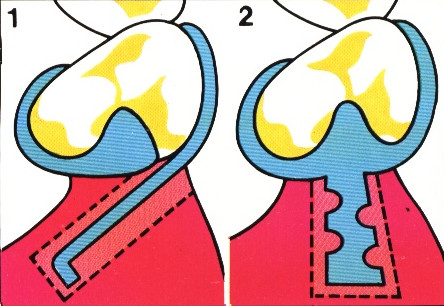

###الأسنان
**297** إن انفصلت إحدى الأسنان عن الجهاز دون ضياعها، فيمكن إعادة تثبيتها بالرّاتنج الإكريليّ البارد، ومن المُفضّل إنشاء نوع من التّثبيت الميكانيّ لتعزيز الارتباط الكيميائيّ.

في حال فقد السّن الاصطناعيّة أو قلع إحدى الأسنان الطّبيعيّة، تُضاف سنّ اصطناعيّة جديدة لملء الفراغ النّاتج عن ذلك. والطّريقة المُثلى لإضافة السّن هي أخذ طبعة ألجينات مع عضّة شمعيّة كما وُصف في الشّكل 295، بحيث يمكن إضافة السّنّ في المخبر.

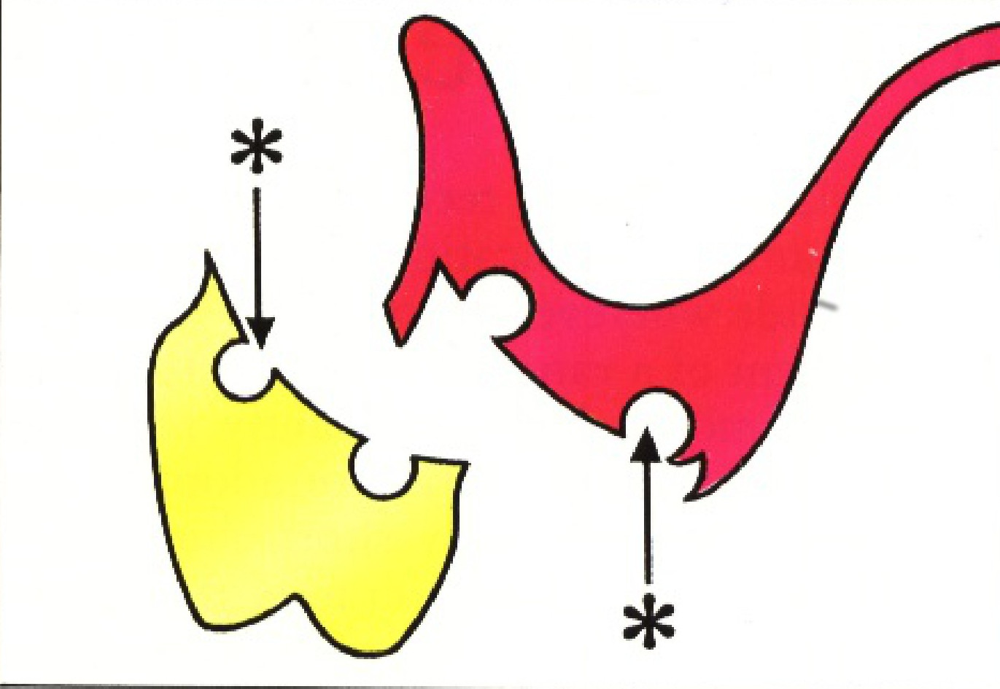

‏**298a** و**298b** تتطلّب إضافة الأسنان إلى الوصلات المعدنيّة إنشاء نوعٍ من التّثبيت الميكانيّ كالثّقوب أو عُرى الأسلاك المُلحومة.

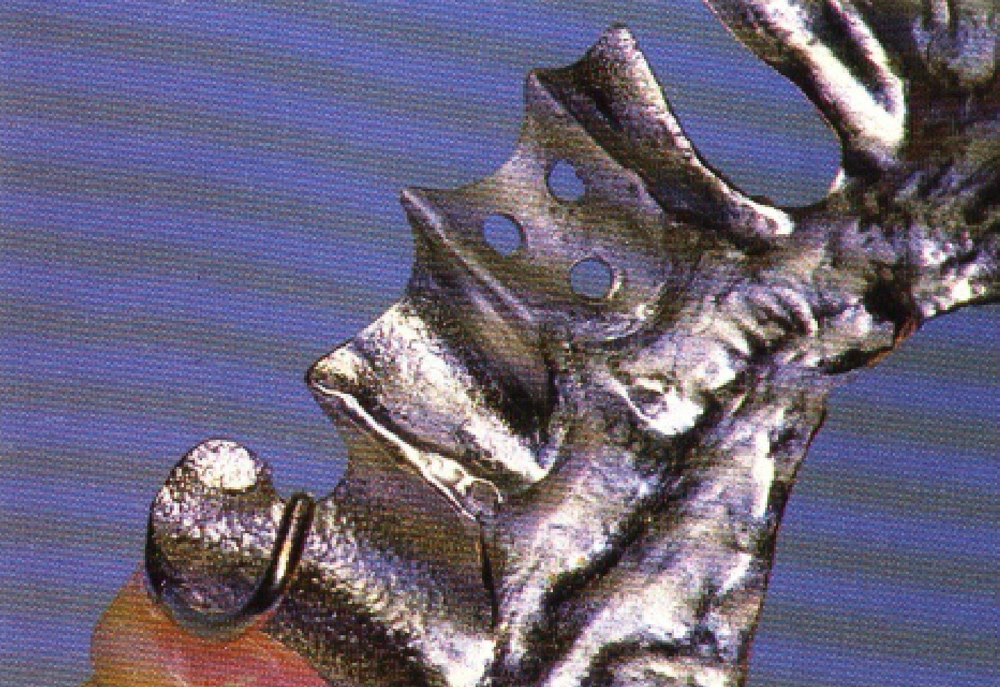 

###الوصلات
**299** إن إمكن تجميع الأجزاء المكسورة من الجهاز الإكريليّ المكسور خارج الفمّ، فيمكن للطّبيب جمعها باستخدام قضيب معدنيّ مُستقيم يُثبّت مع السّطوح الطّاحنة للأسنان بشمع لصّاق أو بتطبيق لاصق من مادّة السيانوإكريلات (cyano-acylate) إلى السّطوح المكسورة. تُفضَّل تجربة الجهاز المُجمّع في الفم لتحرّي الدّقّة (إن أمكن) قبل إرساله إلى المخبر لإصلاحه.

قد يُمكن في بعض الحالات إصلاح الجهاز في العيادة باستخدام الرّاتنج الإكريليّ البارد.

**300** إن لم تتطابق أجزاء الجهاز خارج الفمّ بدقّة، فيجب تثبيتها في أفضل وضع ممكن بتطبيق مادّة بيوتيل ميتاكريلات (butyl methacrylate) أو مركّب الطّبع على طول خطّ الكسر. يوضع الجهاز في الفم والمادّة ما تزال ليّنة ويُثبّت الجزءان في علاقتهما الصّحيحة بالسّروج والأسنان حتّى يتّحد الجزءان بصلابة. ثمّ يُصلح الجهاز في المخبر.

عادة ما نُضطّر لإعادة صنع الجهاز إن لم يُمكن ضمّ الجزأين أو إن كُسرت وصلة معدنيّة أو تعرّضت للانحناء.

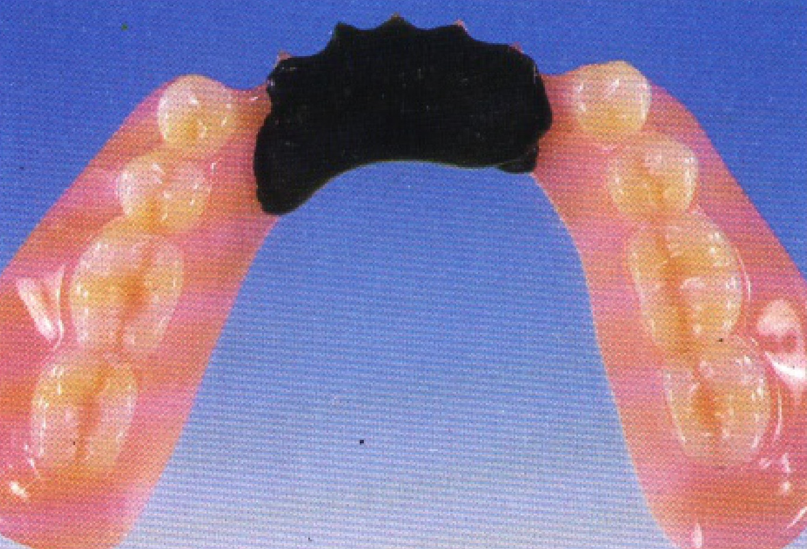

###أجنحة الجهاز
**301** يمكن إضافة أو تمديد الأجنحة باستخدام راتنج بيوتيل ميتاكريلات الّذي يمكن تكييفه في الفمّ مباشرةً، إلّا أنّ الاستقرار اللّونيّ لهذه الرّاتنجات ضعيف نسبيًّا مما يجعله غير ملائم عندما تكون الأجنحة مرئيّة أو عندما سيبقى الجهاز مُستخدمًا لفترة أكثر من بضعة أسابيع.

لإضافة الأجنحة في المخبر، تُؤخذ طبعة ألجينات والجهاز في الفم باستخدام طابع جاهز شُكّلت حدوده بمُركّب الطّبع بمعناية في المنطقة الّتي ستُضاف الأجنحة فيها.

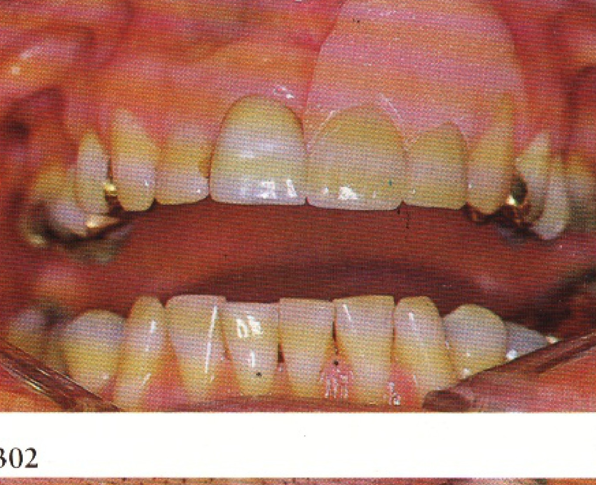

**302** كحلّ بديل، تُستخدم مادّة مُشكّلة للحدود كشمع الحوافّ الّذي يُضاف إلى الجهاز ويُشكّل بحيث يلائم المنطقة الّتي ستُغطّى بالجناح الجديد. تؤخذ بعد ذلك طبعة مطّاطيّة للمنطقة ضمن الجناح المُعدّل.

####التّبطين المؤقّت
قد يُعاد تبطين الجهاز الجزئيّ مؤقّتًا في حالة عدم استقراره أو تأذي النّسج الرّخوة النّاجمَين عن غياب الانطباق.

تُجرى إعادة التّبطين في الفم باستخدام موادّ قاسية أو رخوة. يُفضّل استخدام الموادّ الرخوة (مُكيّفات النّسج) في حالات التهاب المخاطيّة لما لها من تأثير يُشبه تأثير الوسادة، والّذي يُساهم بتوزيع الحمل بشكل أكثر انتظامًا ممّا يُساعد على شفاء النّسج. أمّا الموادّ القاسية فهي الرّاتنجات الإكريليّة الحاوية على مونومير بيوتيل أو ميتيل ميتاكريلات، والأوّل أقلّ تخريشًا للمخاطيّة الفمويّة.

عادةً ما تتطلّب إعادة التّطبيق تهيئة مُسبقة للجهاز.

**303** تُعدّ الطّبعة التّشخيصيّة للجهاز بالألجينات وسيلة سريعة ومفيدة للوصول إلى انطبق الجهاز وتحديد نقاط الضّغط الّتي تتطلّب التّعديل قبل إضافة موادّ التّطبين.

**304** إذا كان الجهاز بحاجة للتّطبين، فإنّه يجب تصحيح كلّ مناطق نقص امتداد الحواف أوّلًا بصبّ الحدود براتنج بيوتيل ميتاكريلات ذي لزوجة عالية. لا يرتبط هذا الرّاتنج بقوّة مع قاعدة الجهاز الإكريليّ وقد يسبّب رضًّا للمخاطيّة الفمويّة إذا سُمح له بتشكيل حافّة زائدة في منطقة الاتّصال بين المادّتين (1)، ويمكن تجنّب ذلك بجعل المادّتين تلتقيان دون تراكب (2).

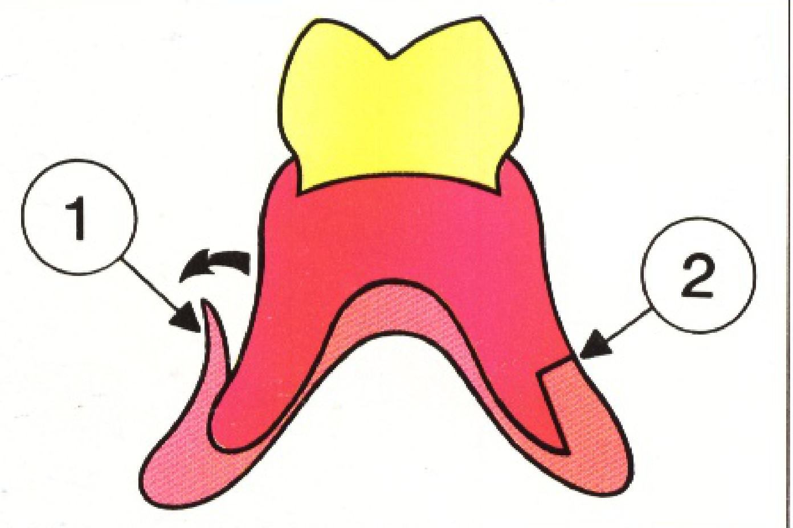

**305** يسهل وقوع خطأ في تطبيق الجهاز في الفمّ أثناء تبطينه بمادّة مؤقّتة، وخصوصًا في حالة الجهاز العلويّ؛ وفي حال حدوثه فإنّ العلاقتين العموديّة والأفقيّة تتغيّران، ويسبّب ذلك أيضًا زيادة سماكة الوصلة ممّا يؤدّي إلى إزعاج المريض وتغيّر موضع السّرج الأماميّ إلى درجة غير مقبولة، لينتهي الأمر بجهاز غير صالح للاستعمال.

**306** يمكن اتّخاذ عددٍ من الاحتياطات لتجنّب احتمال التّطبيق الخاطئ للجهاز أثناء التّطبين، ففي حالة الجهاز العلوية ذي الامتداد الحنكيّ الواسع يكون مجرى خروج زوائد مادّة التّطبين طويلًا ومُتعرّجًا ممّا يجعل اختيار مادّة ذي لزوجة قليلةً أمرًا ضروريًّا؛ وأمّا في الفكّ السّفليّ وفي السّروج الفرديّة، فإنّ مجرى الخروج أقصر بكثير ممّا يسمح باستخدام مادّة تطبين أكثر لزوجة.

**307** عندما نُضطَّر إلى استعمال مادّة تطبين عالية اللّزوجة نسبيًّا، مثل راتنج بيوتيل ميتاكريلات، فإنّه يمكن حفر ثقوب في الوصلة الحنكية والحوافّ الجناحيّة للجهاز لتسهيل خروج الزّائد من المادّة.

**308** عندما يقتصر فقد الانطباق على موضع القلوع الحديثة فإنّه يمكن حصر تطبيق مادّة التّطبين المؤقّتة على هذه المناطق. أمّا سّطوح الطّبعة الأخرى غير المُعدّلة فإنّها تُساعد في ضبط موقع الجهاز على نحوٍ صحيح بالنّسبة للحوافّ والدّعامات المُتبقية. سيكون هناك، بعد تطبيق المادّة، خطّ اتّصال بين الرّاتنج الجديد وسطوح الطّبعة الأصليّة، ويمكن إخفاؤه بتنعيم بسيط لمنطقة الاتّصال وهذا يعطي عادةً نتائج مقبولة.

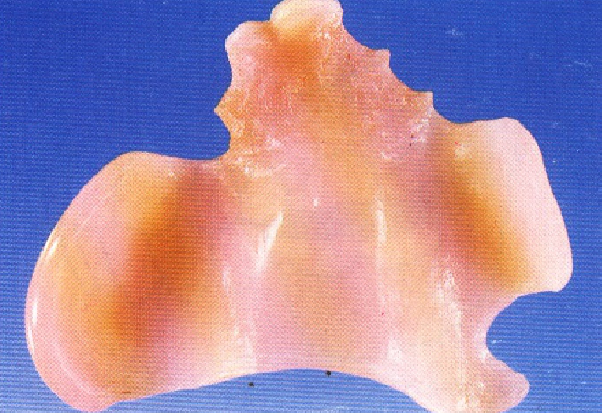

**309** عند استخدام مادّة تطبيق قاسية فإنّه من الضّروريّ تذكّر قابليّتها للانسياب نحو منطاق التّثبيت حول الأسنان ممّا يجعل توقيت إزالة الجهاز من الفمّ أمرًا حاسمًا، لأنّ عدم إزالته قبل اكتمال التّصلّب سيؤدّي إلى انحصاره في موضعه، وعندها لن يمكن إزالته إلّا بقصّ الإكريل في مواضع التّثبيت بالسّنابل، الأمر الّذي يستغرق وقتًا طويلًا.

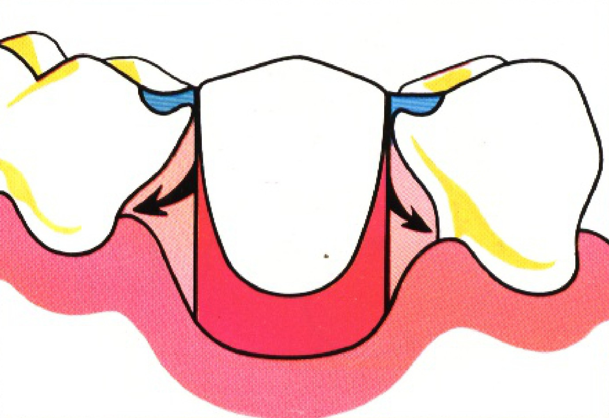

**310** ما إن يُبطّن الجهاز، تُزال زوائد المادّة من السّطوح المُلمّعة والأسنان، وإن كانت المادّة المُستخدمة راتنجًا قاسيًا فإنّ الحدود تُشذَّب وتُلمّع (في الجهاز العلويّ). تُشذَّب زوائد المادّة المُكيّفة للنُسُج على السّطوح المُلمّعة للجهاز بحيث تتألّف الحوافّ من كتلة ناعمة ومُدوّرة من المادّة المُكيِّفة (في الجهاز السّفليّ).

**311** يُعطى المريض الّذي أُعيد تطبين جهازه تعليمات خاصّة عن تنظيف مناطق التّطبين، إذ أنّ بعض أنواع الموادّ المُكيّفة للنُسُج تتعرّض للأذى عند استخدام موادّ تنظيف الأجهزة السّنّيّة الحاوية على البيربورات القلويّة (alkaline perborate)، بينما تتأذّى أنواع أخرى بمواد التّنظيف الحاوية على هيبوكلوريت قلويّ (alkaline hypochlorites)؛ وإن لم يُنبّه المريض لهذا التّعارض فإنّ مادّة التّطبين ستتعرّض للانحلال سريعًا.

تُضاف موادّ التّطبين باعتبارها إجراءًا مؤقّتًا، لذا يجب على الطّبيب اتّخاذ القرار ببدء الخطوة التّالية من المعالجة، فمثلًا: تحتاج المادّة المُكيّفة للنُسُج إلى إلى تقييم أسبوعيّ وتبديل في فترات مُنتظمة حتى يزول التهاب الغشاء المُخاطيّ، وعندها يمكن صنع جهاز جديد.

##التّعديل الإطباقي
**312** أكثر أشكال تلف الأجهزة شيوعًا هو فقدان التّماس الإطباقي بعد استعمال الجهاز لسنوات طويلة والّذي ينتج عن اشتراك تأثير التآكل الإطباقي مع انخفاض مستوى الجهاز بسبب الامتصاص السّنخي. يُفضّل تصحيح الإطباق قبل صنع جهاز جديد لأنّ وضعية الفكّ السّفليّ الجديدة والتهاب الغشاء المخاطيّ النّاتجين عن هذا التّلف قد يتعارضان مع نجاح المعالجة.

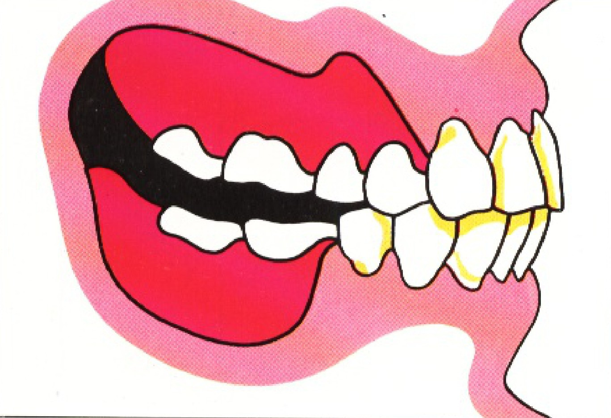

**313**  يمكن إعادة تأسيس التّماسّ الإطباقيّ بعد تطبين السّروج بإضافة راتنج إكريلي بارد ذي لون مُشابه للون الأسنان إلى الأسنان الخلفيّة. يُطّبق الرّاتنج السّائل إلى السّطوح الإطباقيةّ لإحدى الجهازين ويُترك ليصل إلى المرحلة العجينيّة قبل إدخال الجهاز إلى الفم. يُطبّق الفازلين على الأسنان في الجهاز المُقابل ويُقاد الفكّ السّفلي بِلُطف على طول القوس المُتراجع لحركة الإغلاق حتى يحصل التّماس الإطباق المتساوي عند البُعد العمودي المُناسب. يُخرج الجهازان من الفم ويترك الرّاتنج ليتصلّب قبل إجراء السّحل الانتقائيّ لتصحيح الإطباق بشكل بسيط.

##التّعويضات المرحليّة
يُصنع التّعويض المرحليّ قبل تطبيق الجهاز النّهائيّ للأسباب التّالية:

###حفظ المسافة والنّواحي الجماليّة
**314** قد يفرض فقدان سنّ أماميّ تعويضًا سريعًا بجهاز مرحليّ لأسباب اجتماعيّة وكذلك لمنع نقصان المسافة الّذي ينتج عن انسلال الأسنان المُجاورة وميلانها.

###زيادة تحمّل المريض
**315** تواجه نسبة صغيرة من المرضى صعوبةً كبيرة في استخدام الجهاز المُتحرّك، وربّما يستحيل على بعضهم استخدامه، وذلك بسبب منعكس الإقياء الواضح لديهم. في حالات كهذه يمكن تصنيع صفيحة إكريليّة رقيقة تأخذ في الفكّ العلويّ شكل نعل الفرس لتدريب المريض على التّغلّب على منعكس الإقياء. يستخدم المريض الصّفيحة لفترات تزداد طولًا كلّ يوم حتّى يصل إلى درجة مقبولة من التّحمّل تدلّ على إمكانيّة متابعة المُعالجة التّقليديّة. عند استخدام صفيحة تدريب بشكل نعل الفرس، يمكن زيادة الامتداد الحنكي على مراحل للسّماح بتكيّف تدريجيّ على التّغطية الحنكيّة يُقارب المقدار المثاليّ.

في الحالة المُرفقة تتضمّن صفيحة التّدريب تغطيةً إطباقيّة بهدف تعديل علاقة الفكّين تمهيدًا للمعالجة التّرميميّة المُتقدّمة (انظر الفقرة التّالية).

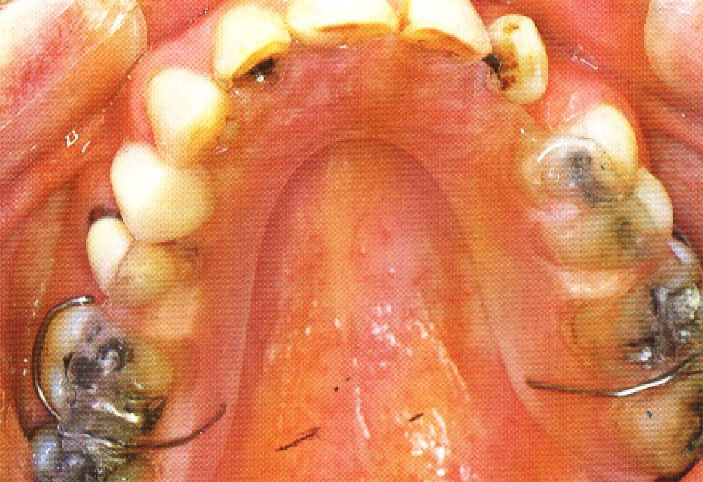

###التّحضير للمعالجات التّرميميّة المُتقدِّمة
إحدى العوامل المُهمّة في نجاح المُعالجات التّرميميّة المُتقدّمة قدرةُ المريض على المُحافظة على درجة عاليّة من السّيطرة على اللّويحة الجرثوميّة. يسمح التّعويض المرحليّ بتقييم دقيق للصّحّة الفمويّة ونظافة الجهاز خلال فترة طويلة قبل بدء المُعالجة النّهائيّة.

قد تفشل المُعالجات التّعويضيّة المُتقدِّمة بسبب التّوقّعات الخياليّة الّتي يفترضها المريض عمّا يمكن لجهاز مُتحرِّك أن يُقدّمه، لينتهيَ الأمر بسخط المريض ورفضه للمعالجة الّتي أُجريَت، ولذلك فإنّ صنع تعويض مرحليّ يسمح للمريض بتجربة مواضع قصور الأجهزة المُتحرّكة؛ وهذه التّجربة، مع الشّرح الدّقيق لأهداف المُعالجات التّالية وما يُتوقَّع منها، تُعين المريض على تشكيل صورة أكثر واقعيّة وقبول أكبر للتّعويض النّهائيّ.

###تعديل علاقات الفكّين
قد تنتج التّغيّرات التّكيّفيّة في علاقة الفكّين عن فقد الأسنان، أو الفقد الواسع للمادّة السّنّيّة، أو غياب الأسنان الخلقيّ. قد تتطلّب هذه التّغيّرات التّصحيح قبل بدء المعالجة التّرميمية ويمكن تحقيق ذلك بالتّعديل الإطباقيّ التّدريجيّ للتّعويض المرحليّ حتّى الوصول إلى علاقة إطباقيّة مثاليّة.

**316** تتعقّد خطّة ترميم الأسنان المُتهدّمة بصورة كبيرة بسبب عدم التّأكّد من إمكانيّة احتمال المريض لزيادة البعد العموديّ الإطباقيّ الضّروريّة لاستيعاب التّرميم المطلوب.

يُصنع تعويض مرحليّ ببعد إطباقيّ يبدو من التّقييم الأوّل مُناسبًا، ثمّ يمكن تعديله تدريجيًّا على جلسات مُتعدّدة، مما يسمح بفترة تكيّف تدريجيّة على الزّيادات الصّغيرة في البعد العموديّ الإطباقيّ وصولًا إلى ارتفاع مناسب يمكن اعتماده في خطّة المعالجة التّالية.

**317** قد تكون الأجهزة المرحليّة مُفيدةً في حالات المرضى المُعرَّضين للرّضوض اللّثويّة النّاتجة عن العضّة العميقة في مستوى القواطع.

يُساعد جهاز بسيط بصفيحة حنكيّة في توفير راحة فوريّة للمريض أثناء تحديد نوع المعالجة: هل هي تقويميّة أم ترميميّة أم لثويّة أم جراحيّة؟

**318** قد تساعد الصّفيحة الحنكيّة في المرضى صغار السّنّ بتحسين الحالة وذلك بسماحها للأسنان الخلفيّة بالبزوغ ممّا يسمح بانغراس الأسنان الأماميّة السّفليّة.

**319** يجب ألّا يُستخدم جهاز مُغطٍّ لحدبات الأسنان الخلفيّة فقط لتصحيح الرّض اللّثويّ لأنّ ذلك قد يؤدِّي إلى استمرار بزوع الأسنان الأماميّة لينتهي الأمر بعود العلاقة الراضّة السّابقة مُجدّدًا.

##معالجة التهاب الفم بالأجهزة

**320** التهاب الفم النّاجم بالأجهزة (Denture stomatitis) هو التهابٌ منتشر في المخاطيّة الحاملة للجهاز المُتحرّك، وغالبًا ما يكون مُتعدِّد الأسباب.

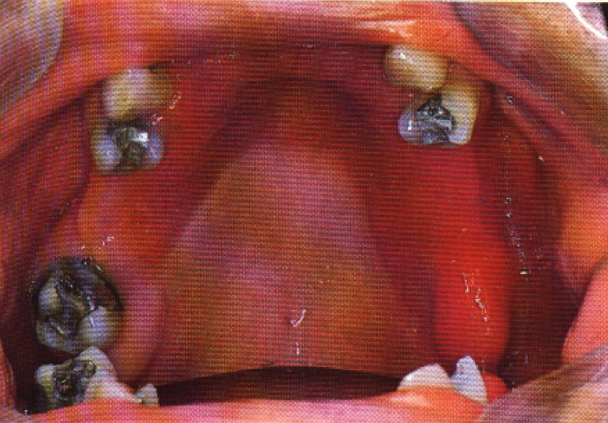

أكثر أسبابه شيوعًا الرّضوض النّاجمة عن الأجهزة وفرط نمو فطر _المُبيضَّات البيض (Candida albicans)_ الّذي يتفاقم بسوء السّيطرة على اللّويحة. ومن عوامله المؤهّبة بعض الحالات الجهازيّة كالدّاء السّكريّ وعوز الحديد وفيتامين B12 وحمض الفوليك، والعلاج ببعض الأدوية كالصّادّات الحيويّة واسعة الطّيف والستيروئيدات والعوامل السّامّة للخلايا.

يجب بدء العلاج قبل أخذ الطّبعات النّهائيّة لإزالة الالتهاب والانتباج في المخاطيّة.

**321** في الشّكل المُرفق بعض العوامل المُسبّبة والمؤهّبة والّتي يُحتمل أن تُساهم في حدوث التهاب الفمّ النّاجم بالأجهزة. التّفاعل المُحتمل بين العوامل المُختلفة مُعقّد، ولكنّنا سنوضّح إحدى السيناريوهات المُحتملة لحدوثه: تبدأ الرّضوضُ النّاجمة عن الجهاز تفاعلًا التهابيًّا، ويؤدّي ترقّق المخاطيّة إلى زيادة نفوذيّتها وخروج النّتحة الالتهابية، والتّي تُشكّل بالمشاركة مع الخلايا المُتوسّفة وسطًا مُغذّيًا يُحرِّض على نمو _المبيضّات البيض_. بالإضافة إلى ذلك، قد تؤدّي هذه النّتحة والوسط الغنيّ بسكّر القصب (الذي ينتج عن نوعيّة الغذاء المُرافق لاستعمال الأجهزة المُتحرّكة)، قد يؤدِّيان إلى زيادة التصاق خلايا المُبيضّات مُشجّعًا بدوره تشكّل اللّويحة، وبحدوث التّكاثر الفطريّ يزداد مُعدّل إنتاج السّموم الفعّالة من هذه العضويّات الدّقيقة. يُسهِّل ترقّق المخاطيّة وزيادة نفوذيّتها مرور هذه السّموم إلى الأنسجة، ممّا يؤدّي إلى تفاقم الاستجابة الالتهابيّة ودخولها في حلقة مُفرغة. تُفرز الأجسام المُضادّة للمبيضّات في اللّعاب من الغدّة النكفيّة ولكنّ قاعدة الجهاز تحدّ من وصولها إلى المُبيضّات.

**322** قد تكون العوامل المُسبّبة منفردة أو مشتركة كما هو موضّح قُطريًّا في الشّكل - ففي المريض رقم (1) يكون سبب الآفة تكاثر المُبيضّات، وفي المريض (2) بسبب رضّ الأجهزة وفي المريض رقم (3) بسبب تشارك العوامل السّابقة.

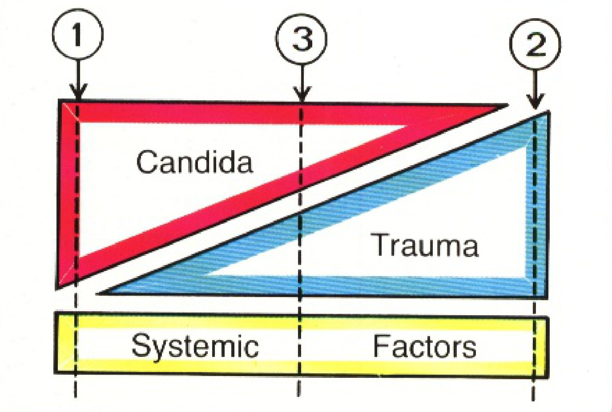

يجب تحديد موضع كل مريض مُصاب بالتهاب الفم النّاجم عن الأجهزة على هذا المقياس بهدف تحديد المُعالجة المُناسبة.

**323** إذا كانت سيطرة المريض على اللّويحة تحت الجهاز ضعيفة فيجب على الطّبيب أن يعرض اللّويحة على المريض باستخدام محلول كاشف ويوضّح له خطورة اللّويحة ويعطيه تعليمات إزالتها بالشّكل الأمثل.

**324** لتنظيف الجهاز يُنصح المريض باستخدام فرشاة صغيرة الرأس متوسّطة القساوة ومتعدّدة الأشعار، لأنّها تسمح بالوصول إلى جميع أجزاء الجهاز وتتكيف بشكل جيّد مع سطوحه. يجب استخدام مادّة قليلة السّحل بالنّسبة للرّاتنج الإكريلي مع الفرشاة، ومن هذه الموادّ الصّابون. يجب الانتباه إلى أن العديد من معاجين الأسنان الخاصّة وحتّى بعض معاجين الأجهزة المُتحرّكة تحتوي جزئياتٍ ساحلةٍ تضرّ بالرّاتنج الإكريليّ.

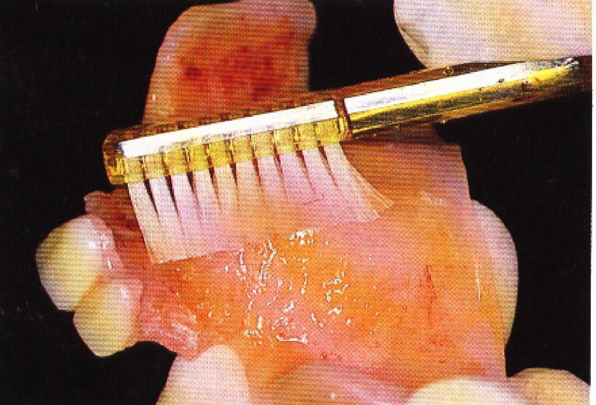

**325** يجب أيضًا نقع الأجهزة الإكريليّة في مادّة منظّفة حاوية على هيبوكلوريت الّذي ثبت أنّه الأكثر فعاليّة بين الموادّ الكيميائيّة المُزيلة للويحة. نُقعَت صفيحة إكريليّة تحوي لويحةً مكشوفة بمادّة كاشفة جزئيًّا لمدّة 20 دقيقة في مادّة مُنظِّفة. لُوحظ أنّ الجزء المُنقوع (الأيمن) أصبح خاليًا من اللّويحة.

**326** يجب ألّا تُنقَع الأجهزة الحاوية على كروميوم الكوبالت لمدّة طويلة في مُنظّفات الهيبوكلوريت بسبب احتمال تآكل المعدن.

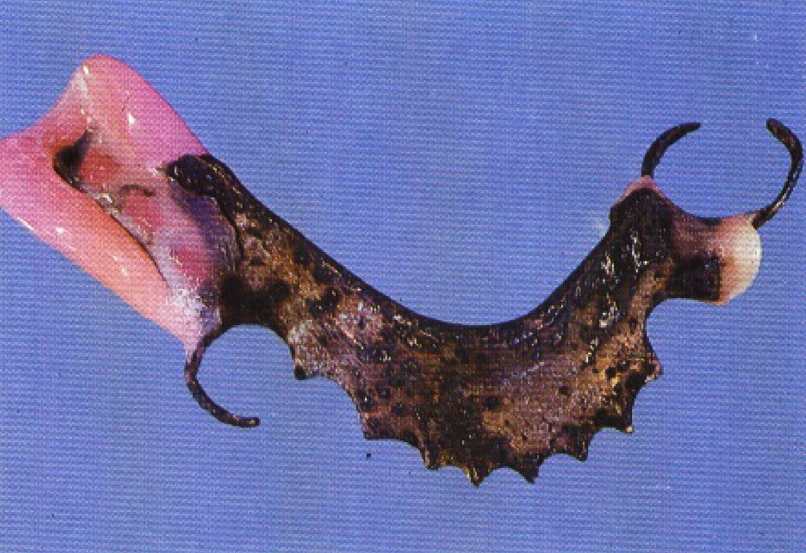

إذا تبيّن أنّ الرّضوض تُساهم في التهاب الفمّ بالجهاز فيجب إجراء التّعديلات المُناسبة مثل تصحيح الإطباق والتّطبين المؤقّت وفق الإجراءات الّتي شُرحت في الأقسام السّابقة من هذا الفصل. يُنصح المريض في بعض الحالات بترك الجهاز خارج فمه لأطول فترة ممُكنة.

إن لم تُشفى الآفة بهذه الإجراءات الموضعيّة فيجب تحرّي الأسباب الجهازيّة. في حالات مُعنِّدة كهذه قد يكون تناول مضادّات الفطور مثل Amphotericin B أو Nystatin أو Miconazole مُفيدًا. يجب التّنبيه على أنّ هذه الأدوية بحدّ ذاتها ضئيلة القيمة وإن لم يُزَل السّبب الأساسيّ لالتهاب الفمّ بالجهاز فإن الحالة ستنكس عند توقّف استخدام الأدوية.

##الجراحة
قد تكون الجراحة ضروريّة قبل صنع الجهاز الجزئيّ لإزالة الجذور المُتبقية أو الأسنان غير البازغة في المناطق الدّرداء ولتجنّب الأمراض المُرافقة للأسنان أو البقايا السّنّيّة. قد تكون الجراحة ضروريّة أيضًا لتحسين مُحيط المناطق الدّرداء بتخفيض النّواتئ العظميّة والنّسج الرّخوة المُفرطة النّموّ وكذلك لإزالة الارتباطات البارزة للألجمة.

**327** تُظهر هذه الصّورة ضاحكًا ثانيًا غير بازغ أثّر على ارتصاف الضّاحك الأوّل مؤدّيًا إلى انحرافه وحشيًّا ممّا جعله غير صالحًا للاستخدام كدعامة. في حال اعُتمد جهاز جزئيّ في هذه الحالة فيجب التّخطيط لقلع كلا السّنّين.

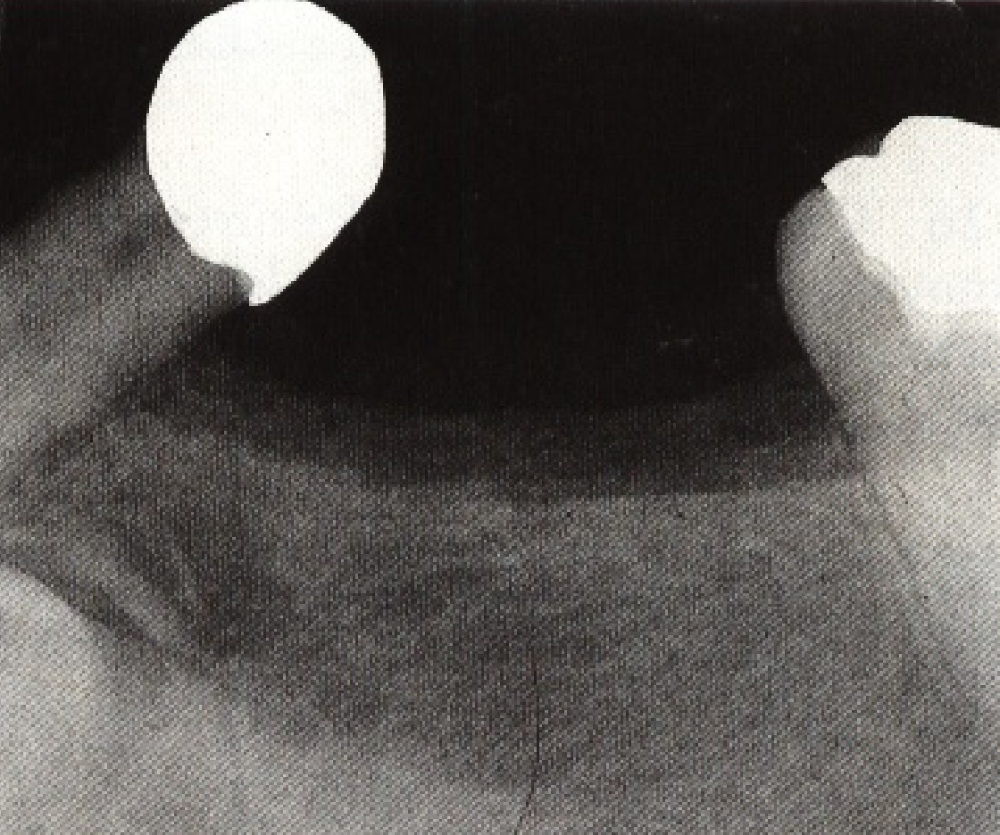

**328** في حالة بزوغ الرّحى الثّالثة بزاوية غير ملائمة فإنّها لا توفّر دعمًا مُناسبًا للجهاز الجزئيّ وتمنع الامتداد الكامل للسّرج ذي النّهاية الخلفيّة الحرّة. يجب قلع هذه الرّحى قبل صنع الجهاز.

**329** تُعيق النّاميات العظميّة في الفكّ السّفليّ إدخال الجهاز الجزئيّ والتّوضّع الصّحيح للوصلة اللّسانيّة. يُعتبر تخفيضها جراحيًّا عمليّة بسيطة نسبيًّا.

**330** توفّر الحدبات البصليّة والمُتحرّكة دعمًا ضعيفًا لسروج الأجهزة الجزئيّة وقد تخلق مشاكل في توجيه المستوي الإطباقيّ. يُحسِّن تخفيضها جراحيًّا مُحيط الأنسجة الرّخوة وانسجامها.

**331** نتجت هذه المنطقة الموضّعة من فرط تصنّع الأنسجة الرّخوة عن الاستخدام المديد لجهاز سيّئ الصّنع. يجب إزالة هذه النّسج قبل تصنيع جهاز جديد، ويجب إرسال الأنسجة المُزالة إلى مخبر التّشريح المرضيّ لفحصها نسيجيًّا.

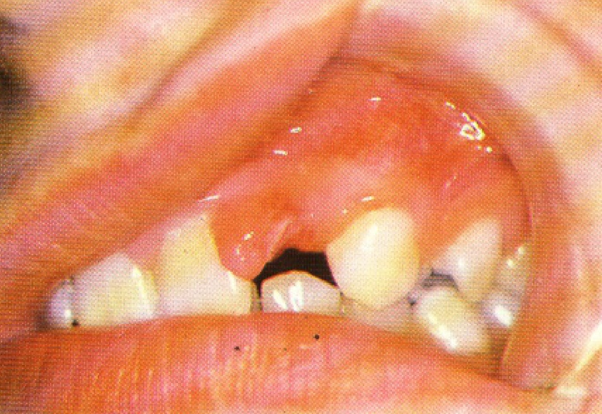

الجراحة مستطبّة بوضوح في هذه الحالة. عندما تترافق الآفة مع أجنحة الجهاز المُتحرّك، فإنّه يجب تقصير هذه الأجنحة للسّماح بشفاء الالتهاب قبل تقييم الحاجة للجراحة.

##معالجة الأنسجة الدّاعمة
بيّنت دراساتٌ عديدة أنّ استخدام الأجهزة الجزئيّة يُعزِّز تراكم اللّويحة الجرثوميّة، ولذلك فإنّ تأسيس حالة صحِّيّة للأنسجة الدّاعمة قبل المعالجة التّعويضيّة أمرٌ مهمّ، وكذلك إعطاء تعليمات مُفصّلة للمرضى حول إجراءات العناية الفمويّة بما يضمن إبقاء تراكم اللّويحة حول الدّعامات السّنّيّة والجهاز المُتحرّك في حدوده الدّنيا.

لهذا السّبب يجب توجيه كلّ المرضى للعناية بأفواههم وإجراء المعالجات الأساسيّة للنُّسُج الدّاعمة. قد تتطلّب بعض الحالات إجراءات أكثر شمولًا.

**332** يترافق استخدام الجهاز الجزئيّ مع درجة من الالتهاب في اللّثة والمخاطيّة الفمويّة حتى في الأفواه النّظيفة سطحيًّا. تُشفى التّغيّرات الالتهابيّة الموضّعة من هذا النّوع إن تحسّنت السّيطرة على اللّويحة وتحسّنت العناية بالجهاز.

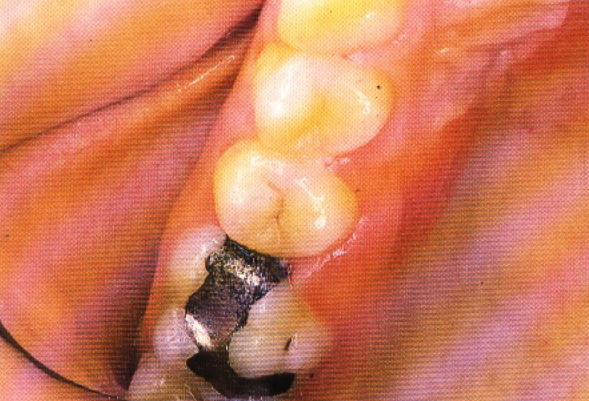

**333** هذا الجهاز الجزئيّ الإكريليّ الّذي يعوّض عن الثّنيتين العلويّتين (11 و12) ذو امتدادٍ واسعٍ وغير مُبرَّر للحوافّ اللّثويّة الحنكيّة.

**334** تكشف إزالة الجهاز التهابًا لثويًّا حفافيًّا مُنتشرًا ودرجة من الالتهاب في المخاطيّة الحنكيّة. يجب كشف الحوافّ اللّثوية إمّا بتعديل الجهاز الحاليّ أو بتطبيق تعويضٍ مرحليّ، لتصبح بعدها السّيطرة على اللّويحة أكثر فعاليّة ولتُشفى الحالة قبل صنع جهازٍ جزئيّ مُتقن من كروميوم الكوبالت.

**335** خلافًا للحالة السّابقة، فإنّ الالتهاب وتأذّي النّسج الرّخوة في هذا الفم قد بلغَا حالةً أصبح معها تحسّن العناية بالفم والجهاز غير مُجدٍ في شفاء النّسج. يجب في هذه الحالة إعادة تشكيل حوافّ النّسج اللّثويّة جراحيًّا قبل صنع جهاز جزئيّ بديلٍ.

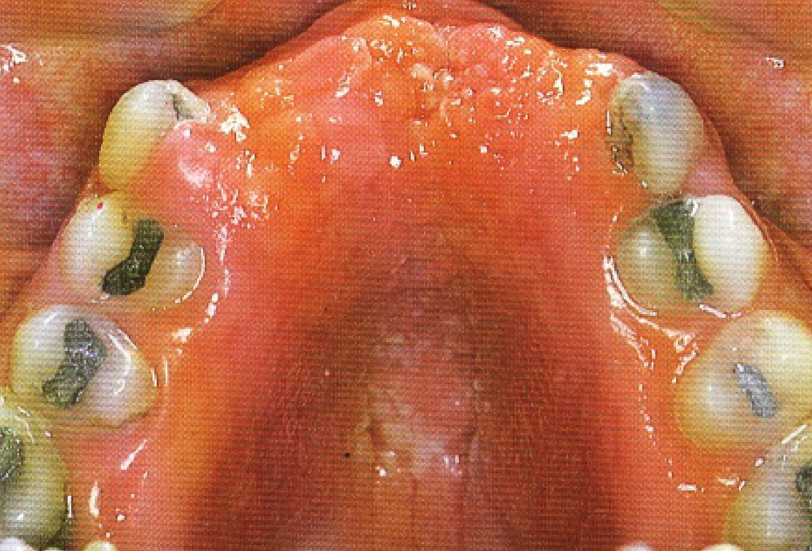

**336** في هذه الحالة، أدّت التّغيّرات الالتهابيّة المؤثّرة في النّسج اللّثويّة الحنكيّة تحت الأجهزة الجزئيّة المُتلاحقة والمحمولة على المُخاطيّة إلى درجة من التضخّم وتشكّل الجيوب وشكلٍ غيرٍ مُفضَّل للنّسج.

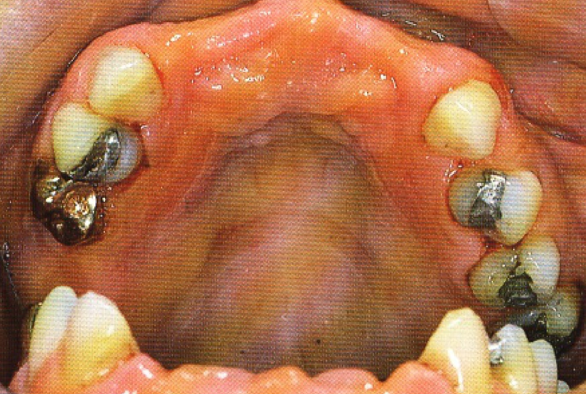

**337** أُجري قطع اللّثة لتحسين حوافّ النّسج الرّخو، فتحسّنت القدرة على العناية الفمويّة ممّا أتاح صنع جهاز جزئيّ من كروميو الكوبالت يسمح بتنظيف سهل للحوافّ اللّثويّة.

‏**338a** يجعل امتداد المساحات الدّرداء وتوزّعها في هذا الفم تجنّب تغطية الحوافّ اللّثوية أمرًا صعبًا، وقد استعمل هذا المريض عدّة أجهزة جزئيّة مُغطّية لقبّة الحنك بالكامل. خفّف الجهاز المرحليّ المعروض في الصّورة تغطية الحوافّ اللّثوية إلى أدنى الحدود المُمكنة.

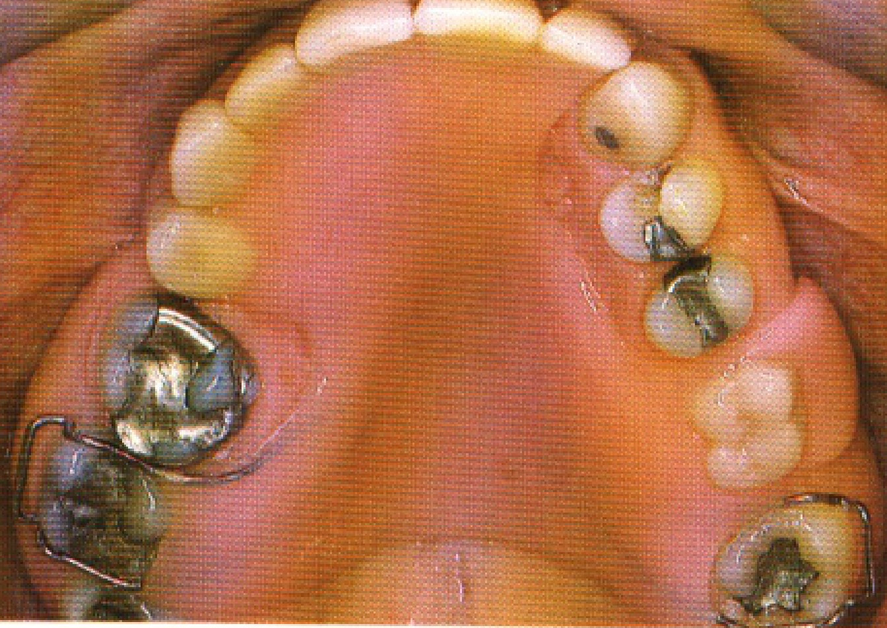

‏**338b** تكشف إزالة الجهاز تحسّن صحّة النّسيج اللّثويّ وبقاء درجة مُعتدلة من الالتهاب في المخاطية في مقدّمة قبة الحنك فقط.

**339** إلّا أنّ التضّخم اللّثويّ أدّى إلى تغطية معظم السّطح الحنكيّ لتاج السّن 27، وفي حال اعتمد هذا السّن كدعامة في جهاز جزئيّ جديد ذي تصميم مُحسَّن، فيجب إجراء قطع اللّثة لكشف التّاج التشّريحيّ. وكذلك يجب استبدال الترميم المعيب على السّنّ 24 بالطّبع.

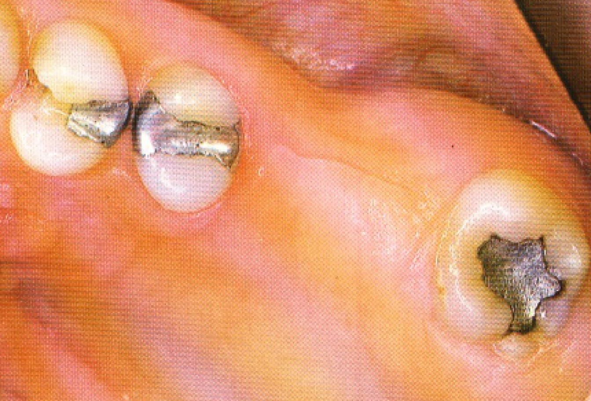

**340** استخدم هذا المريض جهازًا جزئيًّا محمولًا على المخاطيّة في الفكّ السّفليّ ذا سروج حرّة النّهايّة مع قوس لسانيّة من الفولاذ اللّاصدئ. سبّب هذا التّعويض غير المُلائم ضررًا ملحوظًا للنّسج اللّثوية حول 45 و34، مؤدّيًا إلى إبعادهما عن السّطوح الوحشيّة واللّسانيّة للدّعامات السّنيّة. تُلاحَظ توضّعات القلح فوق اللّثويّ وتحت اللّثويّ ويُبدي السّنّ 45 حركةً زائدةً.

من المُهمّ تقييم إمكانيّة تصحيح النّسج اللّثويّة وما إذا كانت هذه الدّعامات ذات دعمٍ عظميٍّ جيّد يسمح بدعم الجهاز الجزئيّ المُتحرّكة.

##المعالجة التّقويميّة
قد تُفيد المعالجة التّقويميّة عند الحاجة لتطبيق جهاز جزئيّ مع ضيق المساحة المُتوفّرة للتّعويض بسبب حركة الاسنان المُجاورة. قد يحدث هذا عند فشل تطوّر الأسنان الدّائمة أو فشل بزوغها، أو عندما تُسبّب المناطق الدّرداء الباقية بلا تعويض انسلال الدّعامات وانزياحها.

**341** في هذه الحالة، سمح غياب الرّباعيّتين العلويّتين مع الفقد المبكر للسّنّ 21 بانسلال الثّنيّة المُتبقيّة عبر الخطّ المتوسّط. لم تُعط المُعالجة التّعويضيّة نتائج جماليّة مُرضيّة.

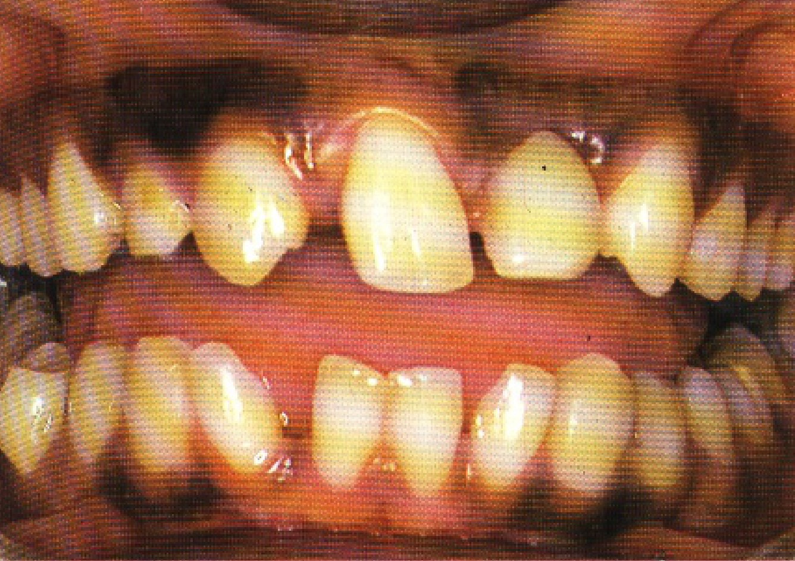

**342** قُلِع النّاب المؤقّت المُتبقّي وطُبِّق جهاز تقويميّ مُتحرِّك لإرجاع 11 نحو ارتصاف أكثر قبولًا.

**343** أُعيد تشكيل المُحيطين الشّفويّ والقاطع لكلا السّنّين 11 و13 وطُبِّق جهاز جزئيّ للوصول إلى مظهر أكثر قبولًا.

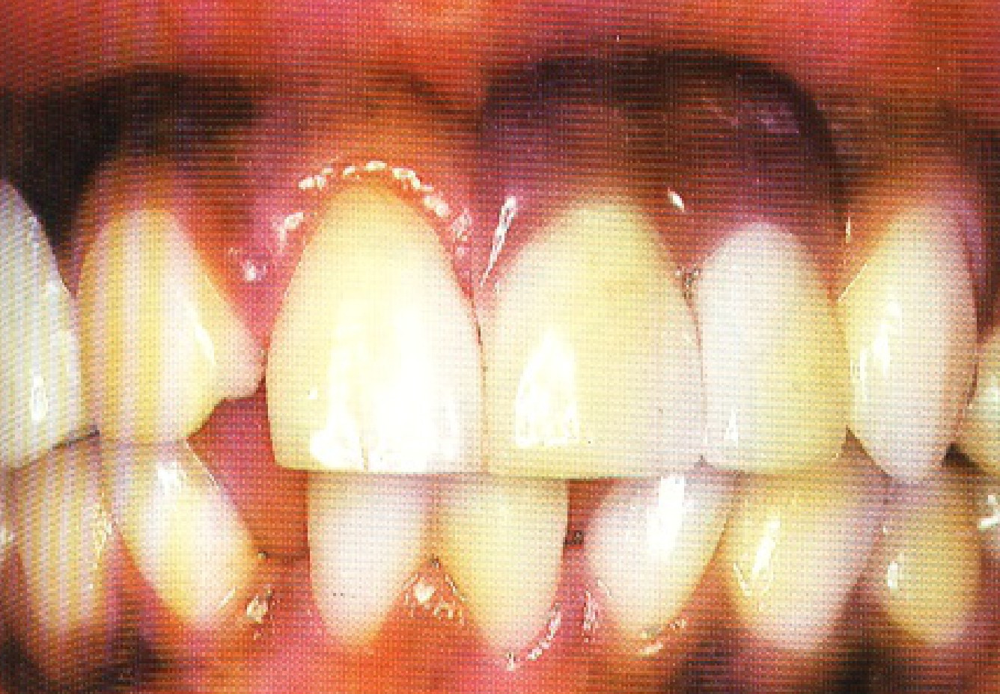

قُرِّرت الآن متابعة المعالجة التّقويميّة لإعادة رصف الأسنان السّفليّة.

**344** سمح غياب التّعويض عن الأسنان الخلفيّة بميلان هذه الّرحى السّفليّة أُنسيًّا. لا توفّر الرّحى في هذا الوضع دعمًا كافيًا للجهاز الجزئيّ، بل تمنع كذلك المحافظة على مستوى مقبولٍ العناية الفمويّة.

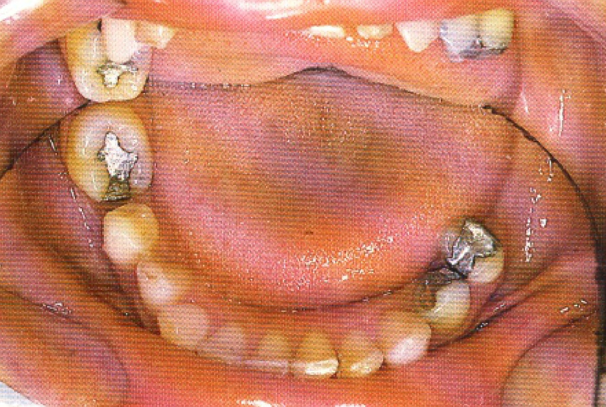

**345** أعادت المُعالجة التّقويميّة المسافة المطلوبة بإعادة وضع الرّحى مُعطيةً دعامةً سنّيّة تقدّم دعمًا وثباتًا كافيين للجهاز الجزئيّ.

في بعض الحالات يكون من الضّروريّ تثبيت الأسنان بشكل دائمًا بعد المُعالجة التّقويميّة، وقد يتضمّن هذا التّثبيت استخدام جهاز جزئيّ. ولكنّ الأجهزة الثّابتة أكثر مُلائمة لهذا الغرض في معظم الحالات.

##المُعالجات المُحافظة
تسبق المُعالجات المُحافظة صنع الجهاز المُتحرّك بالضّرورة لضمان السّلامة السّريريّة للأسنان المُتبقية قبل أخذ الطّبعات النّهائيّة. يسمح هذا بضمان الانطباق التامّ لمكوّنات الجهاز الجزئيّ على الدّعامات السّنيّة طوال فترة استخدام الجهاز. ليس شيءٌ أكثر إزعاجًا من بدء المُعالجات المُحافظة على الأسنان بعد استخدامها كدعامات في جهاز جزئيّ.

في العديد من الحالات تفرض مُتطّلبات تصميم الجهاز الجزئيّ مثل الثّبات والدّعم إجراء تعديلات على السّطوح السّنّيّة وقد فُصِّلت هذه الإجراءات في الفصل التّالي. إلّا أنّه كثيرًا ما يتكرّر أن تُملي هذه العوامل شكل التّرميمات المُفردة. ولهذا يكون من الضّروريّ وضع تصميم مؤقّت للجهاز قبل إنهاء تفاصيل المعالجات المُحافظة.

**346** من المهمّ تقييم وضع الأسنان الّتي ستُستخدم كدعامات في الجهاز الجزئيّ بشكل خاصّ. ففي الحالة المُرفقة السّنّ 16 ذو نخر واسع على التّاج، ومن المهمّ التأكّد من حيويّته أو عدمها، ثمّ التّأكّد من سلامة المُعالجة اللّبّيّة. من المهمّ أيضًا التّأكد من استعادة البنية التّاجيّة بمتانة. وإن كان إنذار السّنّ على المدى البعيد غير معروف، فإنّه من الحكمة اعتبار قلعه والتّعويض عنه في الجهاز الجزئيّ.

**347** عندما تُبرّر الحاجة لترميم واسع للسّن تطبيق تاج كاملٍ ذي وجه خزفيّ، يجب الاستفادة من هذه الفرص لتضمين (1) ميازيب الإرشاد و(2) ومناطق التّثبيت و(3) وحفر المهاميز في التّاج. يجب البدء بهذه التّعديلات في مرحلة تشميع التّاج وذلك بالتّشكيل الدّقيق للشّمع على جهاز التّخطيط. يجب في كلّ الأحوال تذكّر الحاجة لإزالة كمية كافية من البنية السّنّيّة أثناء التّحضير لاستيعاب هذه المُكوّنات لتضمينها ضمن كتلة التّرميم.

**348** كُسرت حدبة 45 الدّهليزيّة مؤخّرًا ورمّمت بترميم أملغم مع دبوس عاجيّ. إن أُريدَ استخدام السّنّ كدعامة للجهاز الجزئي فهناك خطر انكسار السّنّ أو التّرميم بسبب الحمل الزّائد المنقول من مكوّنات الجهاز. لهذا قُرّر ترميمه بتاج كامل ذي وجه خزفيّ.

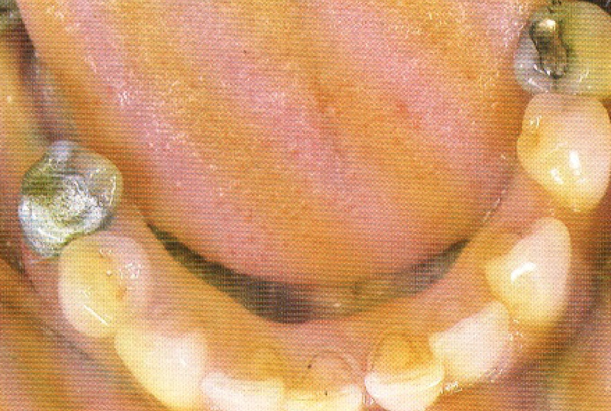

**349** يتضمّن التّرميم النّهائيّ حفرة لمهماز إطباقيّ تؤمّن الدّعم للجهاز الجزئيّ.

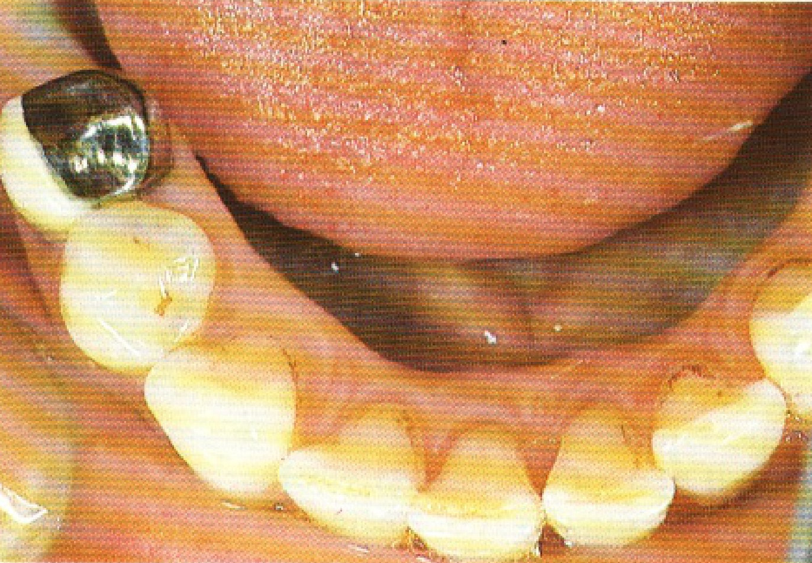

**350** استخدمت تيجان كاملة لتقليل درجة مناطق التّثبيت على السّطوح الدّهليزيّة للرّحوين العلويّتين لتأمين خطّ إدخال ملائم للضمّات.

**351** تكون الحاجة لتعديل المحيط اللّساني للأسنان أكثر شيوعًا في الفكّ السّفليّ. استخدم تاج في هذه الحالة لتقليل مناطق التّثبيت اللّسانيّة للوصول إلى شكل أفشل للضمّات.

في بعض الحالات قد يتطلب الأمر عمليّة مُشابهة على الأرحاء أو الضّواحك المائلة لسانيًّا، وإلّا أدّى ذلك إلى منع إدخال الوصلة اللّسانيّة.

**352** في هذه الحالة رُمّم ضاحك سفلّي ذو خطّ مسحٍ غير ملائم بتاج كامل ممّا سمح بدرجة مقبولة من مناطق التّثبيت لضمّة "I" لثويّة التّوضّع.

أُسِّت سطوح الإرشاد بما يسمح بتحديد خطّ الإدخال والإخراج للجهاز الجزئيّ المُتحرِّك ولتوفير قوّة مُكافئة لذراع الضمّة المُثبّت.

##تحضير الأسنان
قد يكون تحضير الأسنان مطلوبًا لعدّة أسباب:

1. لتأمين حفر المهاميز.
2. لتأسيس سطوح الإرشاد.
3. لتعديل خطوط المسح غير المُفضّلة.
4. لخلق مناطق مُثبّتة.

بالإضافة لذلك، قد يكون تعديل الإطباق جزءًا مُهمًّا من تحضير الأسنان.

يجب التّخطيط لتحضير الأسنان للأجهزة الجزئيّة على أمثلة دراسة مُركّبة على مفصل بعد تحديد خطوط المسح ووضع تصميم الجهاز.

تُشكّل السّطوح المينائيّة عادةً لأيّ من الأسباب السّابقة بسنابل ماسيّ' ذات حجم وشكل مناسبين على قبضة توربين. يجب تنعيم السّطح المينائيّ النّاتج عن التّحضير وتلميعه بسبب خشونته. تتوفّر لهذا الغرض سنابل خاصّة وأحجار وأقراص مطّاطيّة مُغمورة بمادّة ساحلة. يجب تطبيق ورنيش الفلور بشكل روتينيّ على السّطوح المينائيّة المعدّلة لتقليل احتمال النّخور.

###حفر المهاميز
قد يكون من الضّروريّ تحضير حفر للمهاميز:

1. لتأمين سطح سنّي ملائم للدّعم (353)،
2. لمنع التّداخل مع الإطباق (354)،
3. لتقليل بروز المهماز (355).

**353** يميل المهماز المُطّبق على سطح مائل إلى الانزلاق نحو الأسفل على طول سطح السّنّ بسبب الحمل الإطباقيّ (1). قد تؤدّي القوّة الأفقيّة النّاتجة هجرةً شفويّة محدودة للسّن يعقبها فقد أكبر للدّعم الموفّر للجهاز.

يؤدّي تحضير حفرة للمهماز (2) إلى تحميل عموديّ على السّنّ ودعم أكثر فعاليّة للجهاز وغياب حركة السّنّ.

**354** يؤدّي تطبيق مهماز إطباقي في الحالة (1) تماسًّا إطباقيًّا مُبكّرًا (2) ما لم تُحضّر حفرة للمهماز تسمح بتوضّعه ضمن السّنّ (3).

يجب ألّا تُخلق مساحة المهماز ضمن السّن بسحل الحدبة الحنكيّة العلويّة لأنّها حدبة دعم تُساهم في استقرار وضع التّشابك الحدبيّ.

**355** بالإضافة لذلك، فإنّ مهمازًا يوضع على سطح سنّيّ غير مُحضّر (1) سيتوضّع أعلى من السّطح ويميل إلى تجميع جزيئات الطّعام مؤدِّيًا إلى صعوبات مُحتملة في تحمّل الجهاز.

يسمح تحضير حفرة مهماز (2) بتشكيل المهماز بحيث يندمج مع محيط السّنّ وجعله أقلّ ظهورًا للمريض.

###حفر المهاميز على الأسنان الخلفيّة
**356** في الصّورة تصميم مهماز على سنّ خلفيّ:

1. من منظور إطباقيّ،
2. من منظور أنسيّ وحشيّ،
3. من منظور ملاصق.

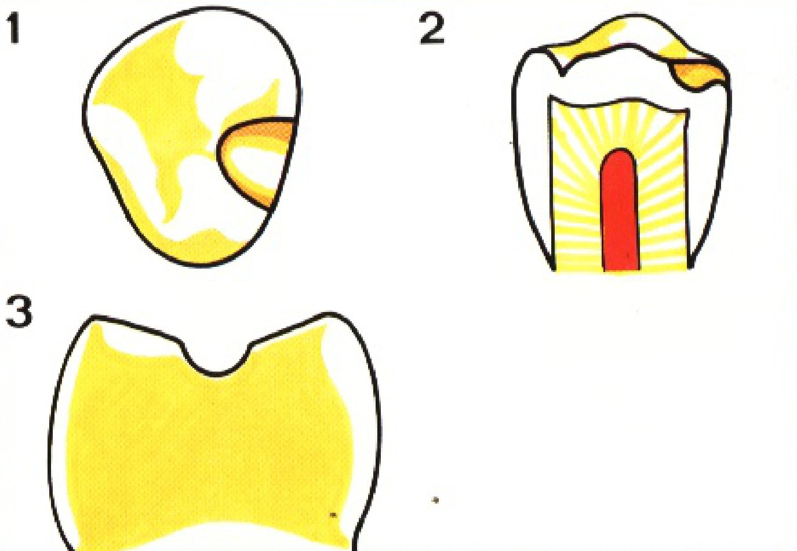

نرى أنّ التّحضير يشمل تخفيض الارتفاع الحفافيّ بهدف ضمان كتلة كافيّة من المادّة الّتي تربط المهماز الإطباقيّ للوصلة الصّغرى.

يجب أن تكون حفرة المهماز مشابهة للفنجان بحيث تسمح بحركة محدودة في الاتّجاه الأفقيّ للمهماز في الحفرة، وذلك للسّماح بتبديد بعض الطّاقة الّتي تنشأ من القوة الإطباقيّة المُطبَّقة على الجهاز.

**357** قد يؤدّي تحضير حفرة علبيّة الشّكل للمهماز إلى تطبيق حمل أفقيّ ضارّ على السّنّ الدّعامة. يجب أن تقتصر حفر المهاميز على الأجهزة ذات الدّعم السّنّيّ والّتي تكون حالة الأنسجة الدّاعمة فيها جيّدة.

**358** يجب أن لا تقل ثخانة المهماز عن 1 مم لتأمين متانة كاملة. لتحرّي الإزالة الكافية للميناء أثناء تحضير حفرة المهماز بما يستوعب ثخانة المعدن، يجب أن يطلب من المريض أن يُطبق على شريط من الشّمع الأحمر المُليَّن. سُتبيّن ثخانة الشّمع في منطقة حفرة المهماز ما إذا كانت كميّة الإزالة كافية.

**359 و360** إذا كانت الضمّة ستمتدّ دهليزيًّا من مهماز إطباقيّ ولا تتوفّر مسافة إطباقيّة كافية لذلك، فيجب أن يمتد التّحضير على شكل قناة على السّطح الدّهليزيّ للسّنّ.

 

###حفر المهاميز على الأسنان الأماميّة
يُعرض تصميم حفر المهاميز على الأسنان الأماميّة في الشّكلين **361** و**364**.

**361** على الأسنان العلويّة الأماميّة، والأنياب بالتّحديد، فإنّ الارتفاع المينائيّ الحنكيّ اللّثويّ يكون مُتطوّرًا بشكل مناسب بحيث يخلق تحضير معتدل الحجم حول مُحيطه حفرةً لمهماز دون اختراق الميناء.

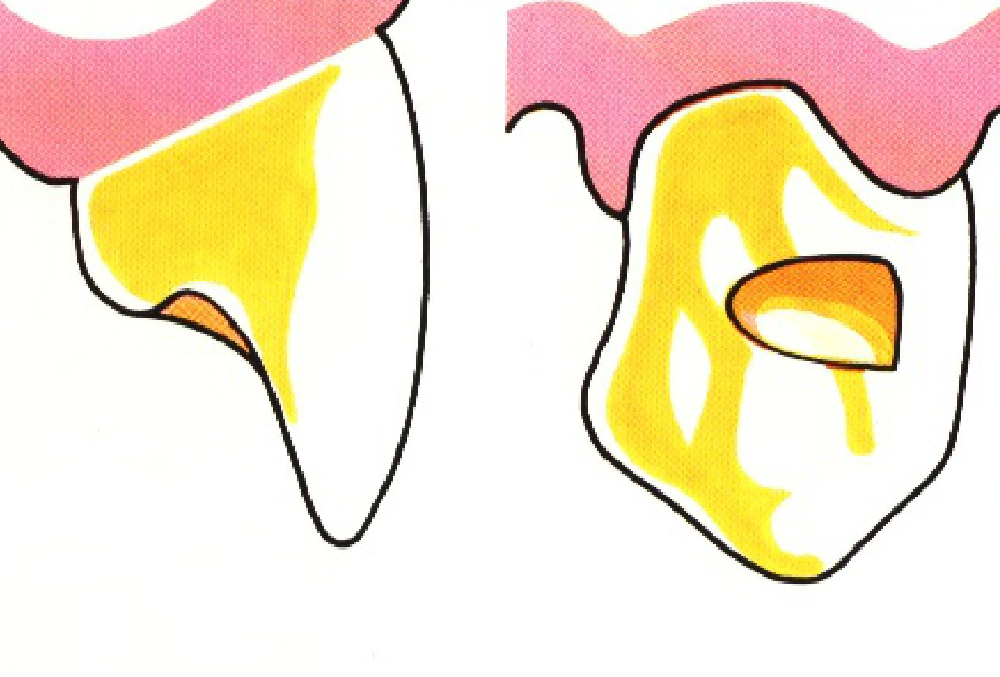

**362** تُستخدم سنبلة أسطوانيّة ماسيّة ذات رأس مُدوّر لتحضير حفرة المهماز. أمّا السّنبلة الكرويّة فإنّها تخلق مناطق تثبيت غير مرغوبة.

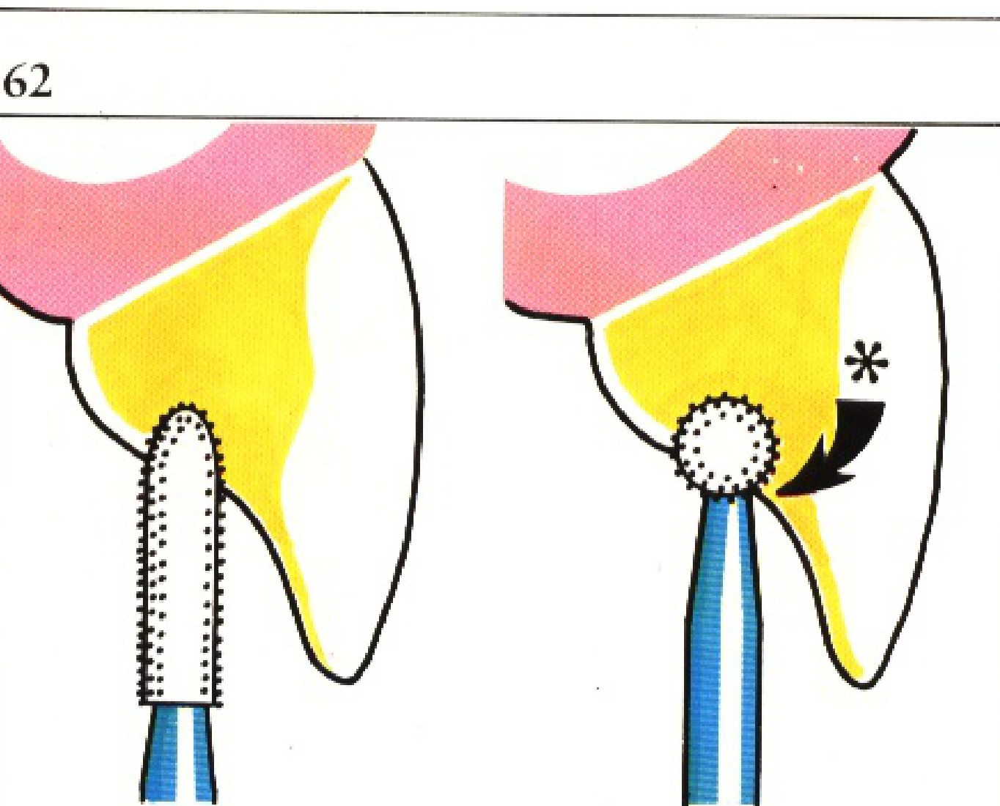

**363** يكون السّطح اللّسانيّ للأسنان الأماميّة السّفليّة متطاولًا كثيرًا ويكون الارتفاع المينائيّ اللّسانيّ اللّثويّ قليل التّطوّر بحيث لا تسمح بتحضير حفرة مهماز دون اختراق الميناء. ولذلك يكون للمهاميز القاطعة استخدامات أوسع في هذه الحالة رغم مظهرها الأقل قبولًا. يُعرض التّحضير من منطور شفويّ (1)، ولسانيّ (2) وملاصق (3).

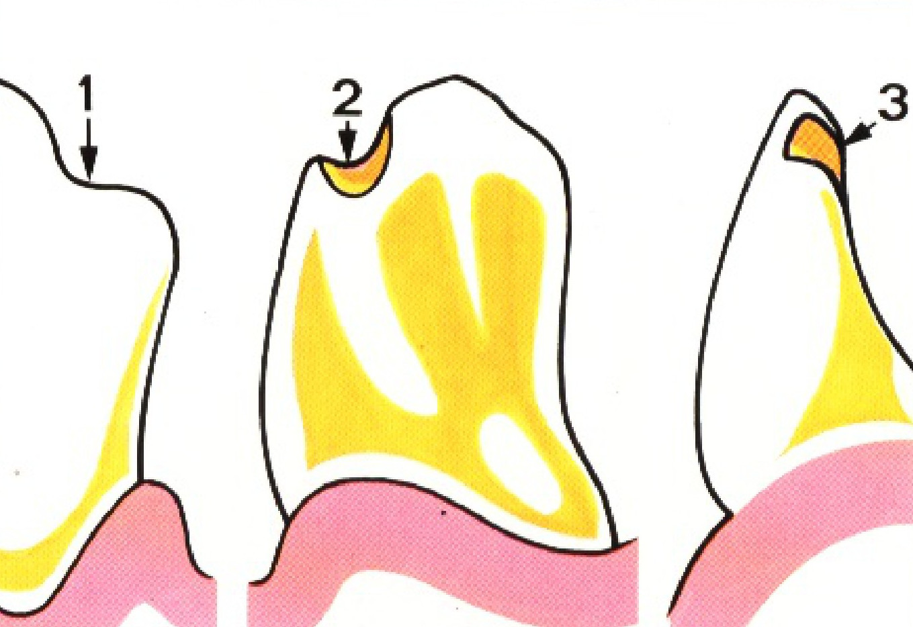

**364** تُحضّر حفر المهاميز على القواطع باستخدام سنبلة مخروطيّة ماسيّة.

###سطوح الإرشاد

**365** تتألّف سطوح الإرشاد من سطحين محوريّين متوازيين أو أكثر على الدّعامات السّنّيّة تَحٌدّ خطّ إدخال الجهاز وإخراجه. قد تنشأ خطوط الإدخال بشكل طبيعيّ، أو قد نضطّر إلى تحضيرها في معظم الحالات.

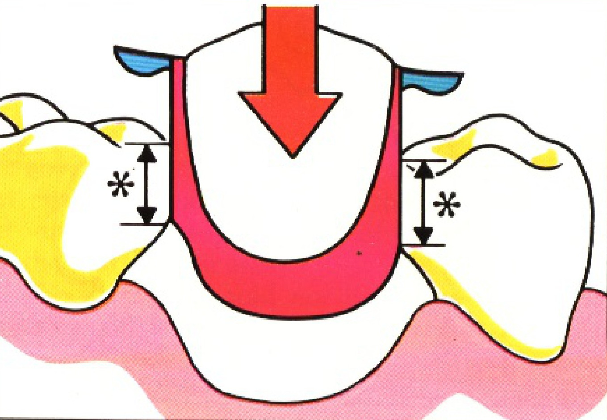

###ميّزات سطوح الإرشاد
من المُتّفق عليه لدى مجموعة واسعة من الممارسين السّريريّين أن استخدام خطوط الإرشاد يوفّر عددًا من الفوائد في صنع الأجهزة الجزئيّة، ومنها:

1. استقرار أفضل
2. التّكافؤ
3. منع تشوّه الضمّات
4. المظهر

####استقرار أفضل
**366** يتحقّق ذلك بمقاومة سطوح الإرشاد لتغيّر موضع الجهاز (السّهمان الأحمران) في اتّجاهات غير موافقة لخطّ الإخراج المُخطّط له.

####التكافؤ
يسمح سطح الإرشاد للعنصر المُكافئ بأن يبقى بتماس مستمرّ مع السّنّ أثناء إخراج الجهاز بالاتّجاه الإطباقيّ. يؤدّي ذلك إلى إجبار الذّراع المُثبّت للضمّة على الانحناء أثناء تحرّكه على طول السّن نحو الأعلى. وهذا التّغيّر المرن في الضّمة هو ما يُنشئ القوّة المُثبّتة.

####منع تشوّه الضّمّة
**368** تضمن سطوح الإرشاد أنّ المريض سُيخرج الجهاز وفق خطّ مرسوم سلفًا (1). تنحني عندها الضّمات ضمن المدى الّذي صمّمت لتنحني ضمنه دون تشوّه.

قد يَحرُف المريض الجهاز دون سطوح الإرشاد أو يُديره عند إخراجه (2)، مما يؤدّي إلى انحناء الضمّات أكثر من المدى المقبول.

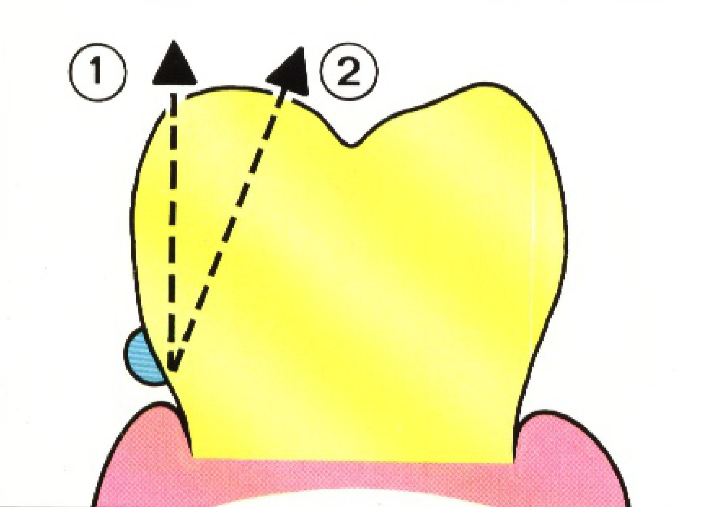

####المظهر
**369** يسمح سطح الإرشاد على الدّعامات الأماميّة بتماس صميميّ بين السّرج والسّن مما يُتيح لأحدهما أن يندمج بالآخر مُعطيًا مظهرًا طبيعيًّا مُقنعًا. نشأت سطوح الإرشاد بصورة طبيعيّة في هذه الحالة فلم نحتج إلى تحضير الأسنان.

####تحضير سطوح الإرشاد
تُحضّر سطوح الإرشاد عادة بالنّظر بالعين بشكل غير دقيق. يجب تعيين وضع القبضة لتحضير سطوح الإرشاد بحيث تكون متوازية فيما بينها وموازية لخطّ الإدخال على مثال الدّراسة.

للتحقّق من دقّة سطح الإرشاد المُحضّر، يمكن أخذ طبعة ألجينات وصبّها للحصول على مثال دراسة ثانٍ. يمكن وضع هذا المثال على جهاز التّخطيط لفحص توازي سطوح الإرشاد باستخدام قضيب التّحليل. إذا كان تصحيح التّوازي مطلوبًا، يمكن متابعة التّحضير في الفمّ.

يمكن اتّباع نهجٍ أكثر دقّة في تحضير سطوح الإرشاد وذلك باستخدام قطع مُصنّعة على مثال الدّراسة ثمّ نقلها إلى الفم إما للتّحكم بتوضّع القبضة أو للتحقّق من موقع إزالة الميناء وكمّيتها.

**370** يجب أن يمتد سطح الإرشاد شاقوليًّا إلى حوالي 3 ملم ويبقة بعيدًا ما أمكن عن الحافّة اللّثويّة.

**371** يجب أن يُحضّر سطح الإرشاد بإزال كميّة صغيرة ومُتجانسة الثّخانة من الميناء، ليست أكثر من 0.5 ملم عادةً، وذلك حول الجزء المناسب من محيط السّنّ (المنطقة الخضراء).

يجب ألّا تحضّر السّطوح كمستوٍ مُسطِّح كما يحدث عند استخدام قرص ساحل (المنطقة الحمراء)، لأنّ هذا يؤدّي إلى إزالة غير ضروريّة وقد يؤدّي إلى اختراق العاج، مما يفرض ترميم السّنّ.

**372** يعتمد موقع سطح الإرشاد المطلوب على وظيفته: فسطح الإرشاد الأحمر في الشّكل يكون مطلوبًا على السّطح الملاصق للدّعامة السّنّيّة المقابلة للمنطقة الدّرداء للتحكّم بخط إدخال السّرج؛ بينما يكون السّطح الأخضر في الشّكل مطلوبًا لتحقيق التّكافؤ مع الضّمة المُثبّتة على سطح السّن الُمقابلة قُطريًّا للجزء المُثبّت من الضّمّة.

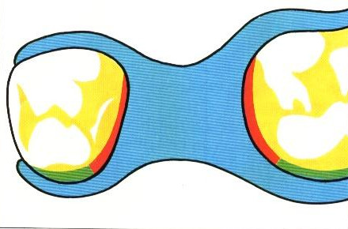

###خطوط التّحديد غير المُفضَّلة
**373 و374** خط التّحديد المُرتفع على السّن قد يؤدّي إلى ضمّة غير مُناسبة بسبب الحاجة لجعل الضّمة قريبة جدًّا من السّطح الطّاحن مُنشئًا تداخلًا إطباقيًّا (السّهمان).

وحتّى إن لم يؤدّي ذلك إلى تداخل إطباقيّ، فإنّ ذراع الضّمّة المُرتفع أكثر ظهورًا للمريض وقد يتداخل مع المضع.

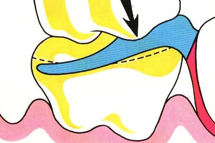 

**375** (1) قد يؤدّي خط التّحديد المُرتفع إلى تشوّه الضّمة لأنّها تُمنع من التّحرك إلى الجزء السّفليّ من السّن أثناء إدخال الجهاز بسبب تماسّها مع السّطح الإطباقيّ. وإن استمرّ المريض في محاولة إدخال الجهاز، فإنّ الضّمّة تنحني نحو الأعلى بدل من انحناءها للخارج.

(2) يسمح تشكيل الميناء بصورة تؤدّي إلى خفض خطّ التّحديد بتوضّع الضّمّة باتّجاه أكثر لثويّة وقيادتها أثناء الإدخال نحو موضعها، مما يؤدّي إلى انحناءها خارجًا عبر خطّ التّحديد كما خُطِّط لها.

###المناطق المُثبّتة
**376** يمكن إنشاء المناطق المُثبّتة بسحل الميناء. ولكنّ الميناء رقيق في الثّلث اللّثويّ للتّاج حيث يجب أن تتوضّع ذروة الضمّة عادةً، ممّا يجعل كميّة الإزالة المُتاحة دون اختراق الميناء محدودةً جدًّا. من المفضّل عادةً تأسيس مُحيط أفضل للتّثبيت بالطّرق التّرميميّة الّتي نُوقشت في الفصل السّابق.

**377** يمكن أيضًا إنشاء المناطق المُثبّتة باستخدام ترميمات الكومبوزيت ذات التّخريش الحمضيّ.

يُفضّل إنشاء سطح واسع للارتباط بين الميناء والتّرميم بحيث يُقلِّل احتمال انفصال التّرميم ويجعل مُحيط السّن أكثر ملائمة للضّمّة.

يجب ألّا يستخدم الكومبوزيت التّقليديّ لهذا الغرض لأنّه قد يؤدّي إلى انسحال ملحوظ في ذراع الضّمة يتلوه إضعاف الضّمة وفقدان الثّبات. وبهدف تقليل الانسحال المُتبادَل بين الضّمّة والكومبوزيت، يُفضَّل اختيار كومبوزيت فائق النّعومة وتصميم أكثر مرونة للضّمّة.

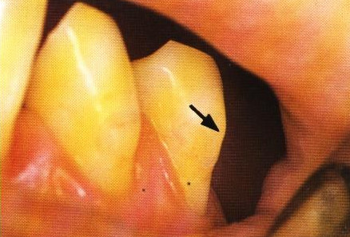

##المُلخّص
صنع الجهاز الجزئيّ المُتحرّك عمليّة مؤلّفة من مراحل مُتعدّدة يجب إجراؤها بالتّرتيب المُحدّد لضمان الوصول إلى تعويض سليم من النّاحية الوظيفيّة والتّجميليّة وغير ضارّ بصحّة المريض، وتشمل هذه العمليّات إعادة تأهيل الحفرة الفمويّة بالوسائل المناسبة سواء المُعالجات المحافظة والجراحيّة والتّقويميّة.

**الكلمات المفتاحيّة:** جهاز جزئيّ مُتحرّك، تحضير الأسنان، التهاب الفم، التثبيت، التكافؤ، خطوط التّحديد، التعويضات المؤقّتة

##Abstract
The fabrication of a removable partial denture is a procedure comprised of multiple steps that should be undertaken in a specific order so that the end result is a functional, asthetically-pleasing denture. Pre-fabrication steps involve rehabilitation of the mouth cavity using all required means, including conventional, surgical and orthodontic treatments.

**Keywords:** RPD, tooth preparation, stomatitis, retention, reciprocation, survey lines, interim prothesis

##المراجع (References)
* J.C. Davenport, R.M. Basker, J.R. Heath, J.P. Ralph. _A Colour Atlas of Removable Partial Dentures_.
